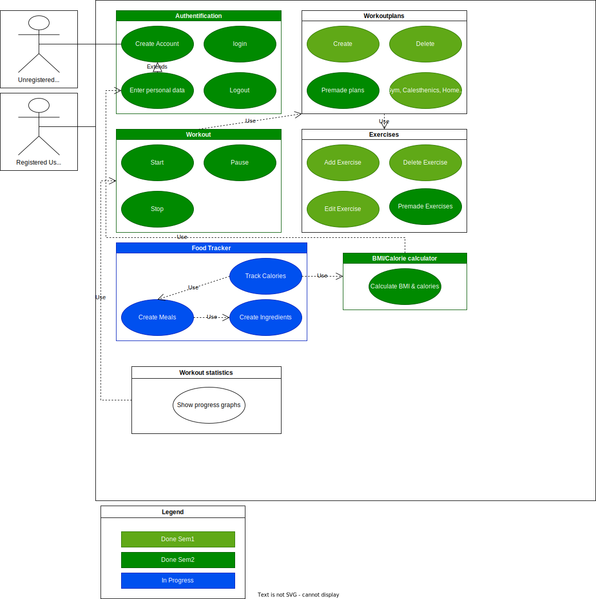
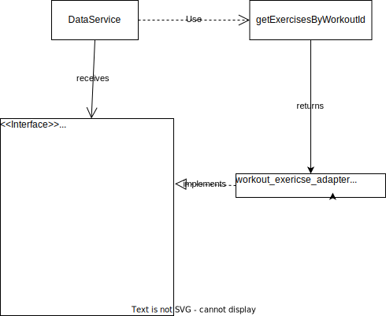
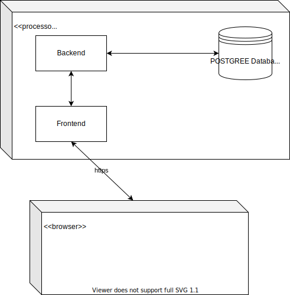

# Software Architecture Document

# Table of Contents
- [Introduction](#1-introduction)
    - [Purpose](#11-purpose)
    - [Scope](#12-scope)
    - [Definitions, Acronyms and Abbreviations](#13-definitions-acronyms-and-abbreviations)
    - [References](#14-references)
    - [Overview](#15-overview)
- [Architectural Representation](#2-architectural-representation)
- [Architectural Goals and Constraints](#3-architectural-goals-and-constraints)
- [Use-Case View](#4-use-case-view)
- [Logical View](#5-logical-view)
    - [Overview](#51-overview)
    - [Architecturally Significant Design Packages](#52-architecturally-significant-design-packages)
- [Process View](#6-process-view)
- [Deployment View](#7-deployment-view)
- [Implementation View](#8-implementation-view)
- [Data View](#9-data-view)
- [Size and Performance](#10-size-and-performance)
- [Quality](#11-quality)

## 1. Introduction

### 1.1 Purpose
This document provides a comprehensive architectural overview of the system, using a number of different architectural views to depict different aspects of the system. It is intended to capture and convey the significant architectural decisions which have been made on the system.

### 1.2 Scope
This SAD describes the software architecture of the Rule-the-Gym project. Illustrated are the Use Cases and MVC structure.

### 1.3 Definitions, Acronyms and Abbreviations

| Abbrevation | Description                            |
| ----------- | -------------------------------------- |
| API         | Application programming interface      |
| MVC         | Model View Controller                  |
| SRS         | Software Requirements Specification    |
| UC          | Use Case                               |
| n/a         | not applicable                         |
| tbd         | to be done                             |

### 1.4 References

| Title                                                              		 | Date       | Publishing organization   |
| ---------------------------------------------------------------------------|:----------:| ------------------------- |
| [Rule the Gym Blog](https://rulethegym597135702.wordpress.com/)            | 20.10.2022 | Rule the Gym |
| [GitHub Repository](https://github.com/tthomasb/FitnessWebApp)             | 20.10.2022 | Rule the Gym |
| [Overall Use Case Diagram](../UseCases/Overall_Use_Case_Diagram.drawio.svg)| 20.10.2022 | Rule the Gym |
| [SRS](./SRS.md)                      		                                 | 20.10.2022 | Rule the Gym |
| [UC1 Create a exercise](../UseCases/CreateExercise.md)           		     | 01.11.2022 | Rule the Gym |
| [UC2 Create a workout ](../UseCases/CreateWorkout.md)           		     | 01.11.2022 | Rule the Gym |
| [UC3 Start a exercise ](../UseCases/StartExercise.md)           		     | 17.04.2022 | Rule the Gym |
[UC4 Edit a exercise ](../UseCases/EditExercise.md)           		     | 17.04.2022 | Rule the Gym |
[UC5 Calculate BMI and Calories ](../UseCases/CalculateBMIAndCalories.md)           		     | 01.11.2022 | Rule the Gym |

### 1.5 Overview
This document contains the Architectural Representation, Goals and Constraints as well
as the Logical, Deployment, Implementation and Data Views.

## 2. Architectural Representation
We are trying to implement according to the MVC pattern:

## 3. Architectural Goals and Constraints
We decided to use a combination of angular and node.js as our Framework vor MVC, while angular alredy implements an frontend MVC with its components(html/css=view, ts=controller, model=model) we further extend this with a node.js backend providing access to our database. The database follows the schema of the angular models and provides their data.

## 4. Use-Case View
Our overall UC diagram:

## 5. Logical View

### 5.1 Overview
The following image shows a UML diagram of our project whose elements are categorized by model, view and controller.

### 5.2 Architecturally Significant Design Packages
We are Using [Material Design](https://m3.material.io) for our frontend

Furthermore we used the Adapter Pattern to adapt a database query to an interface in the frontend. The exact procedure can be seen in the following graphic.

## 6. Process View
n/a

## 7. Deployment View
This is our deployment view

## 8. Implementation View

n/a

## 9. Data View
Database EER-Diagram:

## 10. Size and Performance
n/a

## 11. Quality
tbd