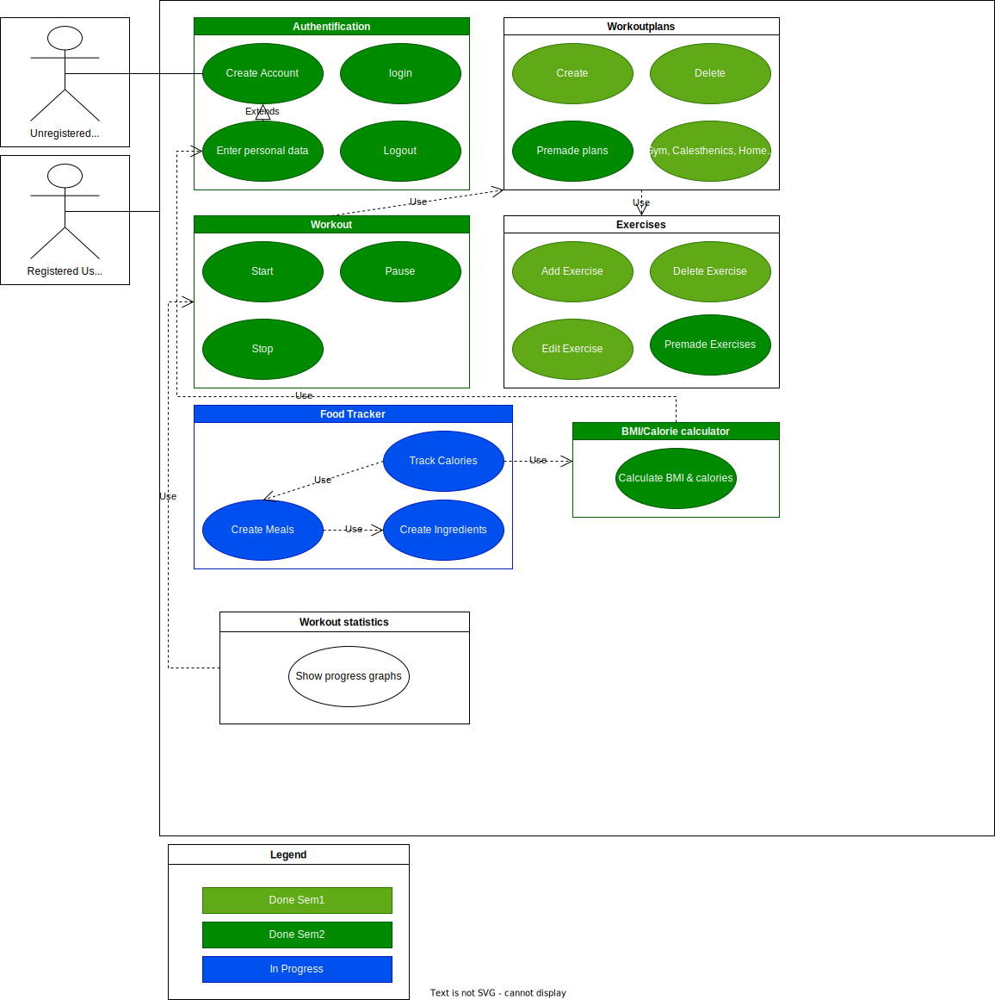

# Rule the Gym - Software Requirements Specification

## Table of contents

- [Table of contents](#table-of-contents)
- [Introduction](#1-introduction)
  - [Purpose](#11-purpose)
  - [Scope](#12-scope)
  - [Definitions, Acronyms and Abbreviations](#13-definitions-acronyms-and-abbreviations)
  - [References](#14-references)
  - [Overview](#15-overview)
- [Overall Description](#2-overall-description)
  - [Vision](#21-vision)
  - [Use Case Diagram](#22-use-case-diagram)
  - [Technology Stack](#23-technology-stack)
- [Specific Requirements](#3-specific-requirements)
  - [Functionality](#31-functionality)
  - [Usability](#32-usability)
  - [Reliability](#33-reliability)
  - [Performance](#34-performance)
  - [Supportability](#35-supportability)
  - [Design Constraints](#36-design-constraints)
  - [Online User Documentation and Help System Requirements](#37-on-line-user-documentation-and-help-system-requirements)
  - [Purchased Components](#purchased-components)
  - [Interfaces](#39-interfaces)
  - [Licensing Requirements](#310-licensing-requirements)
  - [Legal, Copyright And Other Notices](#311-legal-copyright-and-other-notices)
  - [Applicable Standards](#312-applicable-standards)
- [Supporting Information](#4-supporting-information)

## 1. Introduction

### 1.1 Purpose

This Software Requirements Specification (SRS) describes all specifications for the "Rule the Gym" web application. It contains an overview of this project, its vision and detailed information about the planned features.

### 1.2 Scope

This document describes the development process of the project. Rule the Gym allows users to track their workouts and progress using the developers' favorite features in a single web application for free.

### 1.3 Definitions, Acronyms and Abbreviations

| Abbreviation | Explanation                            |
| ------------ | -------------------------------------- |
| SRS          | Software Requirements Specification    |
| UC           | Use Case                               |
| n/a          | not applicable                         |
| tbd          | to be determined                       |
| UCD          | overall Use Case Diagram               |
| BMI          | Body-Mass-Index                        |

### 1.4 References

| Title                                                              | Date       | Publishing organization   |
| -------------------------------------------------------------------|:----------:| ------------------------- |
| [Rule the Gym Blog](https://rulethegym597135702.wordpress.com/) | 20.10.2022 | Rule the Gym |
| [GitHub](https://github.com/tthomasb/FitnessWebApp) | 20.10.2022 | Rule the Gym |
| [Use Case Diagram](https://github.com/willizielke/FitnessWebAppDocumentation/blob/main/UseCases/Overall_Use_Case_Diagram.drawio.svg) | 20.10.2022 | Rule the Gym |

### 1.5 Overview

The second chapter gives an overview of the vision and the UCD (overall use case diagram) of this project. The third chapter (Requirements Specification) provides more details on the specific requirements related to functionality, usability and design parameters. Last but not least, there is a chapter on supporting information.

## 2. Overall Description

### 2.1 Vision

For information about our vision for this web application, see [our first blog post](https://rulethegym597135702.wordpress.com/2022/10/10/week-1/).

### 2.2 Overall Use Case Diagram

### 2.3 Technology Stack

The technolgies we use are:
| Frontend | Backend  | Project Management|
|---------------|-----------------------|-----------------------|
| Angular  | Node Js  | Jira  |
|  | PostgreSQL | GitHub  |
|  |   | Discord  |

More details on some of these specs can be found in [our second blog post](https://rulethegym597135702.wordpress.com/2022/10/13/week-2/).

## 3. Specific Requirements

### 3.1 Functionality

This section explains the different use cases that can be seen in the UCD.
For this project, we plan to implement the following:

- 3.1 a) Authentication
- 3.1 b) Workoutplans
- 3.1 c) Workout
- 3.1 d) Excercices
- 3.1 e) Food Tracker
- 3.1 f) BMI/Calorie calculator
- 3.1 g) Workout statistics

#### 3.1 a) Authentication

The user can create an account, log in and log out
UC Definitions:
| Use                 | UC Definition      |
|-----------------------|-----------------------|
| Create Account  | tbd                |
| Login                 | tbd              |
| Logout              | tbd              |

#### 3.1 b) Workoutplans

The user can create and delete training plans or choose one of the premade plans.
UC Definitions:
| Use                 | UC Definition      |
|-----------------------|-----------------------|
| Create          | [Create Workoutplan](https://github.com/willizielke/FitnessWebAppDocumentation/blob/main/UseCases/CreateWorkout.md)|
| Delete             | tbd              |
| Premade plans         | tbd              |
| Gym, Calesthenics, Home workout   | tbd  |

#### 3.1 c) Workout

The user can start, stop and pause an exercise.

UC Definitions:
| Use                 | UC Definition      |
|-----------------------|-----------------------|
| Start, Stop, Pause    | [Start Exercise](https://github.com/willizielke/FitnessWebAppDocumentation/blob/main/UseCases/StartExercise.md)|

#### 3.1 d) Excercices

The user can create, delete and edit exercises.

UC Definitions:
| Use                 | UC Definition      |
|-----------------------|-----------------------|
| Add Excercise   | [Create Exercise](https://github.com/willizielke/FitnessWebAppDocumentation/blob/main/UseCases/CreateExercise.md)|
| Delete Excercise      | tbd              |
| Edit Exercise        | [Edit Exercise](https://github.com/willizielke/FitnessWebAppDocumentation/blob/main/UseCases/EditExercise.md)|              |
| Premade Excercise     | tbd              |

#### 3.1 e) Food Tracker

The user can track their food.

UC Definitions:
| Use                 | UC Definition      |
|-----------------------|-----------------------|
| Create Meals     | tbd                |
| Track Calories        | tbd              |
| Create Ingredients    | tbd              |

#### 3.1 f) BMI/Calorie calculator

The User is able to calculate his BMI(Body-Mass-Index).

UC Definitions:
| Use                 | UC Definition      |
|-----------------------|-----------------------|
| Calculate BMI & calories  | [Calculate BMI and Calories](https://github.com/willizielke/FitnessWebAppDocumentation/blob/main/UseCases/CalculateBMIAndCalories.md)|                |

#### 3.1 g) Workout statistics

User can see his progress in useful charts.

UC Definitions:
| Use                 | UC Definition      |
|-----------------------|-----------------------|
| Show progress graphs  | tbd                |

### 3.2 Usability

We plan to make the user interface as intuitive and self-explanatory as possible.

### 3.3 Reliability

Since this is a web application, the user does not have to rely on the capabilities of his own personal computer. The only thing to keep in mind is to keep the server running so that the application is accessible at all times.

### 3.4 Performance

Since there is no large number of users the performance is quiet good over all. There are just the exercises and the users workouts which have to be loaded. Mostly users don`t have more than 10 different workouts so that is not a problem at all. The number of Exercises might be something around 100 but that is still not much. it could become problemeatic if the backend was an en actual server and there were thousands of users trying to access their data. In that case there would be need for a more reliable backend.

### 3.5 Supportability

### 3.5.1 Coding Standards

- comment complicated logic so other developers can under stand it
- follow the material stypling guide lines
- DRY out your code 

### 3.5.2 Testing Strategy

- E2E Testing with Protractor and Cucumber
- Unit Testing with Karma and Jasmine

### 3.6 Design Constraints

- Similar to the Angular Design Guidelines

### 3.7 Online User Documentation and Help System Requirements

- Will be added in the Future

### 3.8 Purchased Components

- None
- In the future propably some food API

### 3.9 Interfaces

#### 3.9.1 User Interfaces

- Login - Some login Screen
- Sidenav - navigate Between different parts of the application
- Create/Edit Dialog - Allows user to Create and edit workouts and exercises
- Start Workout Dialog - Allows user go trough his/her workout and track their workout data
- BMI Dialog - Allows users to enter their personal data and calculate their bmi

#### 3.9.2 Hardware Interfaces

(n/a)

#### 3.9.3 Software Interfaces

- The application will be available in any browser

#### 3.9.4 Communication Interfaces

client and server will communicate via http

### 3.10 Licensing Requirements

Runs under the MIT License

### 3.11 Legal, Copyright, and Other Notices
We do not take legal responsibility for any negative thing happening in connection with our app. We do not claim any copyright to anything we have used except the name "Rule The Gym".

### 3.12 Applicable Standards

- Angular Coding Standards

## 4. Supporting Information

For any further information you can contact the Rule the Gym Team or check our [Rule the Gym blog](https://rulethegym597135702.wordpress.com/). 
[Rule the Gym Team](https://rulethegym597135702.wordpress.com/team/):

- Thomas Bäuml
- Nick Günter
- Johannes Schmälzle
- Willi Zielke
- Nikolas Ganska
