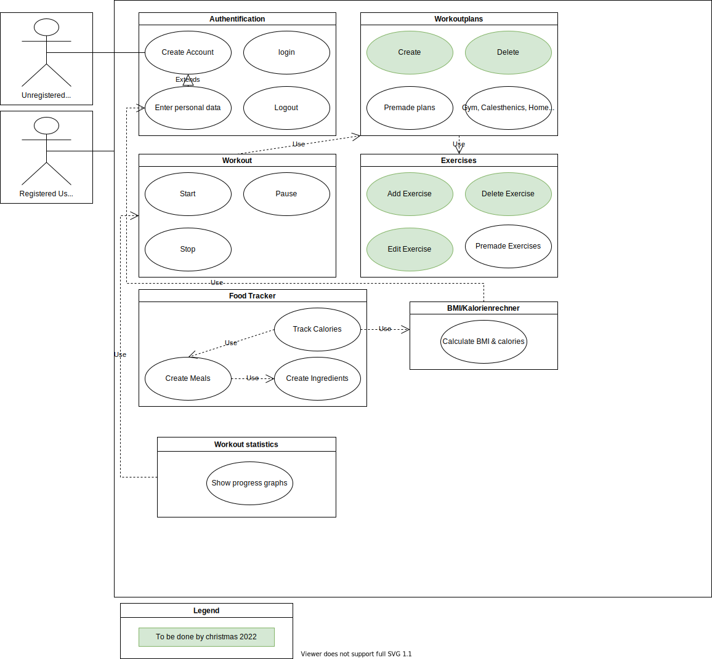

# Rule the Gym - Software Requirements Specification 

## Table of contents
- [Table of contents](#table-of-contents)
- [Introduction](#1-introduction)
    - [Purpose](#11-purpose)
    - [Scope](#12-scope)
    - [Definitions, Acronyms and Abbreviations](#13-definitions-acronyms-and-abbreviations)
    - [References](#14-references)
    - [Overview](#15-overview)
- [Overall Description](#2-overall-description)
    - [Vision](#21-vision)
    - [Use Case Diagram](#22-use-case-diagram)
	- [Technology Stack](#23-technology-stack)
- [Specific Requirements](#3-specific-requirements)
    - [Functionality](#31-functionality)
    - [Usability](#32-usability)
    - [Reliability](#33-reliability)
    - [Performance](#34-performance)
    - [Supportability](#35-supportability)
    - [Design Constraints](#36-design-constraints)
    - [Online User Documentation and Help System Requirements](#37-on-line-user-documentation-and-help-system-requirements)
    - [Purchased Components](#purchased-components)
    - [Interfaces](#39-interfaces)
    - [Licensing Requirements](#310-licensing-requirements)
    - [Legal, Copyright And Other Notices](#311-legal-copyright-and-other-notices)
    - [Applicable Standards](#312-applicable-standards)
- [Supporting Information](#4-supporting-information)

## 1. Introduction

### 1.1 Purpose
This Software Requirements Specification (SRS) describes all specifications for the "Rule the Gym" web application. It contains an overview of this project, its vision and detailed information about the planned features.

### 1.2 Scope
This document describes the development process of the project. Rule the Gym allows users to track their workouts and progress using the developers' favorite features in a single web application for free.
 
### 1.3 Definitions, Acronyms and Abbreviations
| Abbreviation | Explanation                            |
| ------------ | -------------------------------------- |
| SRS          | Software Requirements Specification    |
| UC           | Use Case                               |
| n/a          | not applicable                         |
| tbd          | to be determined                       |
| UCD          | overall Use Case Diagram               |
| BMI          | Body-Mass-Index                        |

### 1.4 References

| Title                                                              | Date       | Publishing organization   |
| -------------------------------------------------------------------|:----------:| ------------------------- |
| [Rule the Gym Blog](https://rulethegym597135702.wordpress.com/) | 20.10.2022 | Rule the Gym |
| [GitHub](https://github.com/tthomasb/FitnessWebApp) | 20.10.2022 | Rule the Gym |
| [Use Case Diagram](https://app.diagrams.net/#G1aa64pIfEBD05uafiBBfeoUI94t6ecAl9) | 20.10.2022 | Rule the Gym |

### 1.5 Overview
The second chapter gives an overview of the vision and the UCD (overall use case diagram) of this project. The third chapter (Requirements Specification) provides more details on the specific requirements related to functionality, usability and design parameters. Last but not least, there is a chapter on supporting information. 
    
## 2. Overall Description

### 2.1 Vision
For information about our vision for this web application, see [our first blog post](https://rulethegym597135702.wordpress.com/2022/10/10/week-1/).

### 2.2 Use Case Diagram
[UCD](https://app.diagrams.net/#G1aa64pIfEBD05uafiBBfeoUI94t6ecAl9)

### 2.3 Technology Stack
The technolgies we use are:
| Frontend	| Backend		| Project Management|
|---------------|-----------------------|-----------------------|
| Angular		| Node Js		| Jira		|
|		| PostgreSQL	| GitHub		|
|		|			| Discord		|

More details on some of these specs can be found in [our second blog post](https://rulethegym597135702.wordpress.com/2022/10/13/week-2/).

## 3. Specific Requirements

### 3.1 Functionality
This section explains the different use cases that can be seen in the UCD.
For this project, we plan to implement the following:
- 3.1 a) Authentication
- 3.1 b) Workoutplans
- 3.1 c) Workout
- 3.1 d) Excercices
- 3.1 e) Food Tracker
- 3.1 f) BMI/Calorie calculator
- 3.1 g) Workout statistics

#### 3.1 a) Authentication
The user can create an account, log in, log out and enter personal information.
UC Definitions:
| Use	                | UC Definition		    |
|-----------------------|-----------------------|
| Create Account		| tbd  		            |
| Login	                | tbd		            |
| Logout         	    | tbd		            |
| Enter personal data   | tbd		            |

#### 3.1 b) Workoutplans
The user can create and delete training plans or choose one of the premade plans.
UC Definitions:
| Use	                | UC Definition		    |
|-----------------------|-----------------------|
| Create        		| tbd  		            |
| Delete	            | tbd		            |
| Premade plans    	    | tbd		            |
| Gym, Calesthenics, Home workout   | tbd		|

#### 3.1 c) Workout
The user can start, stop and pause a recorded workout.

UC Definitions:
| Use	                | UC Definition		    |
|-----------------------|-----------------------|
| Start         		| tbd  		            |
| Stop 	                | tbd		            |
| Pause         	    | tbd		            |

#### 3.1 d) Excercices
The user can create, delete and edit exercises.

UC Definitions:
| Use	                | UC Definition		    |
|-----------------------|-----------------------|
| Add Excercise 		| tbd  		            |
| Delete Excercise      | tbd		            |
| Edit Exercise   	    | tbd		            |
| Premade Excercise     | tbd		            |
#### 3.1 e) Food Tracker
The user can track their food.

UC Definitions:
| Use	                | UC Definition		    |
|-----------------------|-----------------------|
| Create Meals   		| tbd  		            |
| Track Calories        | tbd		            |
| Create Ingredients    | tbd		            |

#### 3.1 f) BMI/Calorie calculator
The User is able to calculate his BMI(Body-Mass-Index).

UC Definitions:
| Use	                | UC Definition		    |
|-----------------------|-----------------------|
| Calculate BMI & calories		| tbd  		            |

#### 3.1 g) Workout statistics
User can see his progress in useful charts.

UC Definitions:
| Use	                | UC Definition		    |
|-----------------------|-----------------------|
| Show progress graphs  | tbd  		            |

### 3.2 Usability
We plan to make the user interface as intuitive and self-explanatory as possible.

### 3.3 Reliability
Since this is a web application, the user does not have to rely on the capabilities of his own personal computer. The only thing to keep in mind is to keep the server running so that the application is accessible at all times.

### 3.4 Performance
tbd

### 3.5 Supportability

### 3.5.1 Coding Standards
tbd

### 3.5.2 Testing Strategy 
tbd

### 3.6 Design Constraints
tbd

### 3.7 Online User Documentation and Help System Requirements
tbd

### 3.8 Purchased Components
(n/a)

### 3.9 Interfaces

#### 3.9.1 User Interfaces
tbd

#### 3.9.2 Hardware Interfaces
(n/a)

#### 3.9.3 Software Interfaces
tbd

#### 3.9.4 Communication Interfaces
(n/a)

### 3.10 Licensing Requirements
tbd

### 3.11 Legal, Copyright, and Other Notices
tbd

### 3.12 Applicable Standards
tbd

## 4. Supporting Information
For any further information you can contact the Rule the Gym Team or check our [Rule the Gym blog](https://rulethegym597135702.wordpress.com/). 
[Rule the Gym Team](https://rulethegym597135702.wordpress.com/team/):
- Thomas Bäuml
- Nick Günter
- Johannes Schmälzle
- Willi Zielke