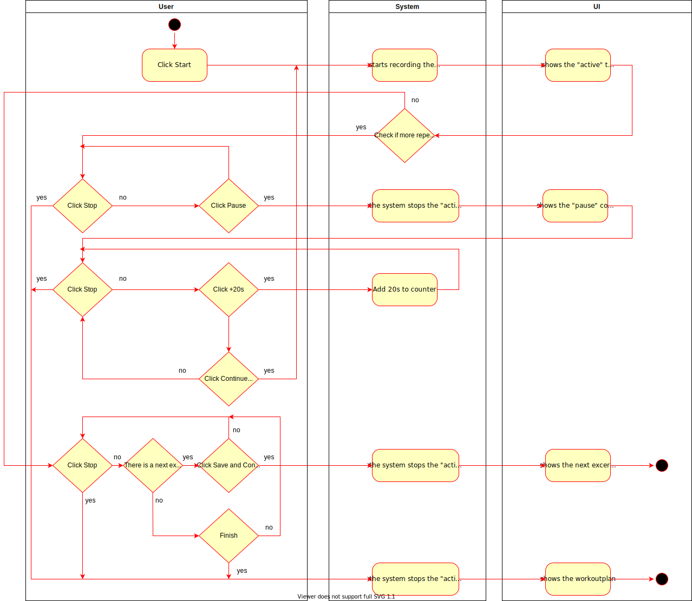
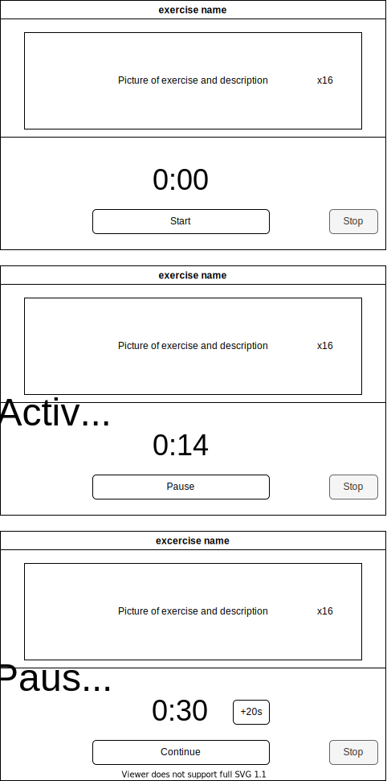

# 1 Use-Case Name

Start Excercise

## 1.1 Brief Description

The user should be able to start their exercises.
The user has to click "Start" to start the exercise timer. 
The user can pause the excercise. 
After the excercise is finished the next excercise will be shown.
If the user stops the excercise, the current workoutplan will be shown.


# 2 Flow of Events

## 2.1 Basic Flow
- User clicks on "Start" to start the exercise and the active time.
- User clicks on "Pause" to pause the exercise, stops the active time and starts the pause countdown time.
- User clicks on "Continue" to continue the next repetition or to go to the next exercise
- User clicks on "Stop" to stop the excercise and go to workoutplan view


### 2.1.1 Activity Diagram



### 2.1.2 Mock-up



### 2.1.3 Narrative

```gherkin
Feature: start exercise

  As a signed in user
  i want to start an exercise

  Background:
    Given I am signed in with username "USER" and password "PASSWORD"
    And I am on the "Workout" page 

  Scenario: start the exercise
    When I press the "Start" button
    Then I am on the "Workout" page
    And I see the timer for the active time

  Scenario: pause the excercise
    When I press the "Pause" button
    Then I am on the "Workout" page
    And I see the countdown time

  Scenario: stop the excercise
    When I press the "Stop" button
    Then I am on the "Workoutplan" page
    And I see the current workoutplan
```

## 2.2 Alternative Flows

(n/a)

# 3 Special Requirements

(n/a)

# 4 Preconditions

The user has to be logged in to the system.
The user has to have navigated to the workout site

# 5 Postconditions

(n/a)

# 6 Extension Points

(n/a)
