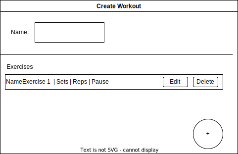

# 1 Use-Case Name

Create Workout

## 1.1 Brief Description

The user should be able to create a workoutplan.
The user has to enter all the information about the workout. For details see 2.1 Basic Flow.

- Enter a Name for the workout
- enter Exercises, per exercise he has to enter
  - reps
  - sets
  - pause time between sets
- enter pause time between exercises

# 2 Flow of Events

## 2.1 Basic Flow

- User clicks on Create new Workout
- User enters Name
- User clicks on add exercise
- User enters reps sets and pausetime
- repeat from add exercise
- User enters Pause time between exercises
- User clicks safe button

### 2.1.1 Activity Diagram

### 2.1.2 Mock-up


### 2.1.3 Narrative
[CreateWorkout.feature](https://github.com/tthomasb/FitnessWebApp/blob/main/Rule-the-Gym/e2e/src/specs/CreateWorkout.feature)
<!-- ```gherkin
Feature: new operation

  As a signed in user
  i want to create a new operation
  and provide additional information regarding my intentions
  in order to find willing helpers.

  Background:
    And I am on the homepage

  Scenario: open new operation dialog
    Given I am signed in with username "USER" and password "PASSWORD"
    And I am on the "main" page
    When I press the "new operation" button
    Then I am on the "new operation" page

  Scenario: enter valid data and save the operation
    Given I am signed in with username "USER" and password "PASSWORD"
    And I am on the "new operation" page
    When I enter "operation XY" in the field "title"
    And I enter "Karlsruhe" in the field "location"
    And I enter "01.01.2018" in the field "date"
    And I enter "public description" in the field "public_descripion"
    And I enter "private description" in the field "private_description"
    And I press the "save" button
    Then I am on the "details" page
    And I receive a "success" message

  Scenario: enter invalid data and save the operation
    Given I am signed in with username "USER" and password "PASSWORD"
    And I am on the "new operation" page
    When I enter "operation XY" in the field "title"
    And I enter "Karlsruhe" in the field "location"
    And I enter "no date" in the field "date"
    And I enter "" in the field "public_descripion"
    And I enter "" in the field "private_description"
    And I press the "save" button
    Then I am on the "new operation" page
    And I receive a "error" message
``` -->

## 2.2 Alternative Flows

(n/a)

# 3 Special Requirements

(n/a)

# 4 Preconditions

The user has to be logged in to the system.
The user has to have navigated to the Training site

# 5 Postconditions

(n/a)

# 6 Extension Points

(n/a)
