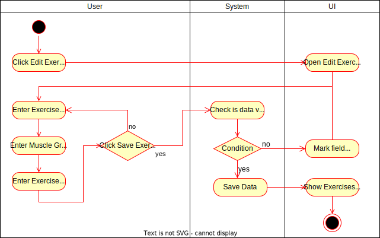
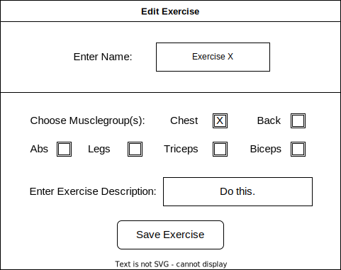

# 1 Use-Case Name

Edit Exercise

## 1.1 Brief Description

The user should be able to edit their own exercises.
The user has to enter all the information about the exercise, which he wants to change.

- Change/Enter a name, muscle group and/or description for the exercise

# 2 Flow of Events

## 2.1 Basic Flow

- User clicks on Edit Exercise
- User can change Name
- User can change Muscle Group
- User can change Exercise Description
- User clicks safe button

### 2.1.1 Activity Diagram



### 2.1.2 Mock-up



### 2.1.3 Narrative

```gherkin
Feature: edit exercise

  As a signed in user
  i want to edit a exercise

  Background:
    Given I am signed in with username "USER" and password "PASSWORD"
    And I am on the "Exercises" page 

  Scenario: enter valid data and save the exercise
    When I press the "Edit exercise" button
    And I change "Crunches" to "Situps" in the field "Name"
    And I not change "Abs" in the field "Muscle group"
    And I not change "Lay on your back, put your hands behind your head and try to get your elbows to your abdomen while rolling yourself in" in the field "Description"
    And I press the "Save" button
    Then I am on the "Exercises" page
    And I receive a "Edited exercise succesfully" message

  Scenario: enter invalid data and save the exercise
    When I press the "Edit exercise" button
    And I not enter "Crunches" in the field "Name"
    And I change "Abs" to "" in the field "Muscle group"
    And I not change "Lay on the ground, put your hands behind your head and try to get your elbows to your abdomen while rolling yourself in" in the field "Description"
    And I press the "Save" button
    Then I stay on the "Edit Exercise" View
    And the false field is highlighted in red
```
-->
## 2.2 Alternative Flows

(n/a)

# 3 Special Requirements

(n/a)

# 4 Preconditions

The user has to be logged in to the system.
The user has to have navigated to the Exercises site

# 5 Postconditions

(n/a)

# 6 Extension Points

(n/a)
